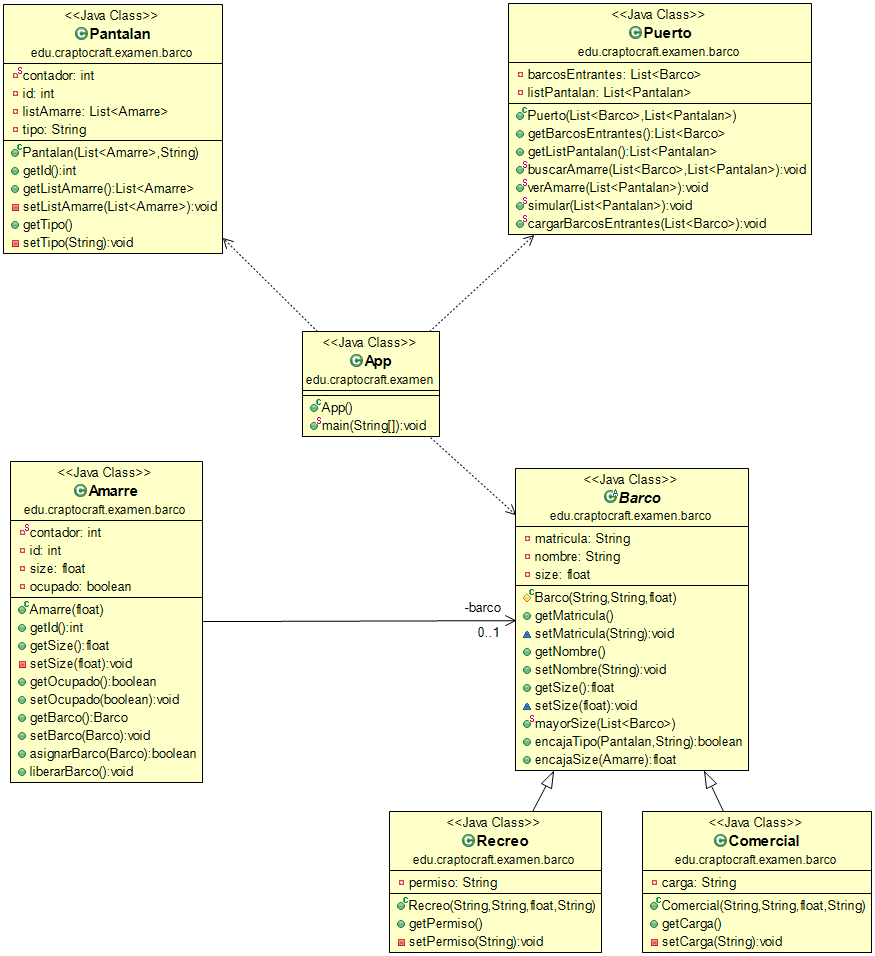
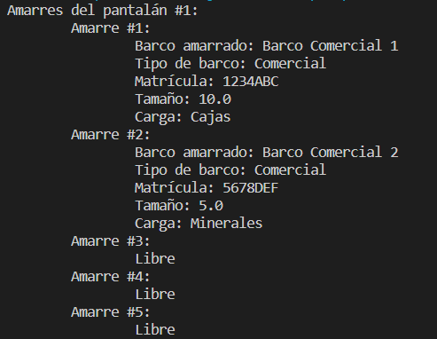
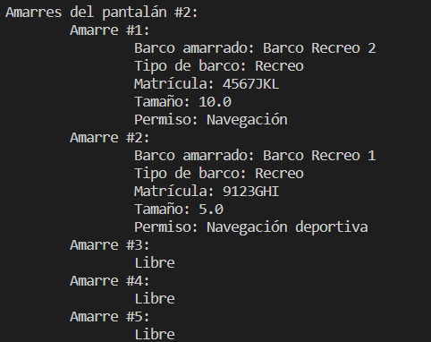

# Examen POO presencial 3 - Barcos

**Table de contenidos**

- [Examen POO presencial 3 - Barcos](#examen-poo-presencial-3---barcos)
  - [Introducción](#introducción)
  - [Instrucciones](#instrucciones)
  - [Diagrama UML](#diagrama-uml)
  - [Salida de la aplicación](#salida-de-la-aplicación)

## Introducción

Este es un examen en Java de 2023 realizado por la clase de DAW (Presencial) de Programación en CIFP Francesc de Borja Moll. Los alumnos realizaron el examen con papel y lapiz, pero nuestro profesor nos propuso a nosotros (clase de DAW Intensivo) el reto de hacer el examen directamente con el ordenador.

## Instrucciones

Desde Autoridad Portuaria se nos solicita que desarrollemos una aplicación que les permita 
gestionar la entrada y salida de los navíos. Para ello crea las siguientes clases con sus 
respectivos métodos:   

**Clase Abstracta Barco**
**Atributos:** String matricula, String nombre, float tamaño. (0,1 Puntos)
- método estático mayorTamaño(ArrayList(Barco) barcosEntrantes). Devuelve la matrícula del barco con mayor tamaño de la lista. (1 Punto)
- método encajaTipo (Pantalan pantalan). Devuelve true si el barco es del mismo tipo que el pantalan, en otro caso devuelve false. (1 Punto)
- método encajaTamaño(Amarre amarre). Devuelve un float igual a la diferencia de tamaño entre el amarre y el barco. (1 Punto)
- método estático cargarBarcosEntrantes(ArrayList(Barco) barcosEntrantes): Cargará en el Array del puerto barcosEntrantes todos los barcos del archivo barcos.txt (1,5 Puntos)

    ```
    Comercial;1234;Poseidon;80   
    Comercial;2345;Triton;30   
    Recreo;3456;Almeja;2   
    Comercial;4567;Tsunami;110   
    Recreo;5678;Berberecho;4   
    Recreo;6789;Mejillon;3   
    Comercial;7890;Ballenato;50  
    ``` 

**Clase Comercial (hija de barco) (0,2 Puntos)**   
**Atributos:** String carga   

**Clase Recreo (hija de barco) (0,2 Puntos)**   
**Atributos:** String permiso   

**Clase Amarre (0,5 Puntos)**   
**Atributos:** id (unico y autoincrementado), float tamaño, boolean ocupado, Barco barco   

**Clase Pantalan (0,5 Puntos)**   
**Atributos:** id (unico y autoincrimentado), ArrayList(Amarre) listAmarre, String tipo (Comercial o Recreo)   

**Clase Puerto**   
**Atributos:** ArrayList(Barco ) barcosEntrantes, ArrayList(Pantalan) listPantalan. (0,1 Puntos)   
- método estático buscarAmarre(ArrayList(Barco ) barcosEntrantes, ArrayList(Pantalan) listPantalan). Asigna un amarre, en el que quepa el barco y el pantalán sea de su tipo, a cada barco de la lista empezando por los barcos de mayor tamaño y si le encuentra sitio lo saca de la lista.  (2 Puntos)
- Extra: asigna al barco el amarre óptimo de todos los disponibles. (1 Punto)
- método estático verAmarre(ArrayList(Pantalan) listPantalan). Enseña por pantalla todos los amarres del puerto junto la información de los barcos que tengan amarrados. (0,5 Puntos)
- método estático simular(ArrayList(Pantalan) listPantalan). Método que podéis usar para crear pantalanes y amarres para añadirlos listPantalan, así como lo que necesitéis para realizar las pruebas. (0,5 Puntos)

**Dispone del main del programa y ejecuta: (0,5 Puntos)**
- cargarBarcosEntrantes
- buscarAmarre
- verAmarre

## Diagrama UML



## Salida de la aplicación



